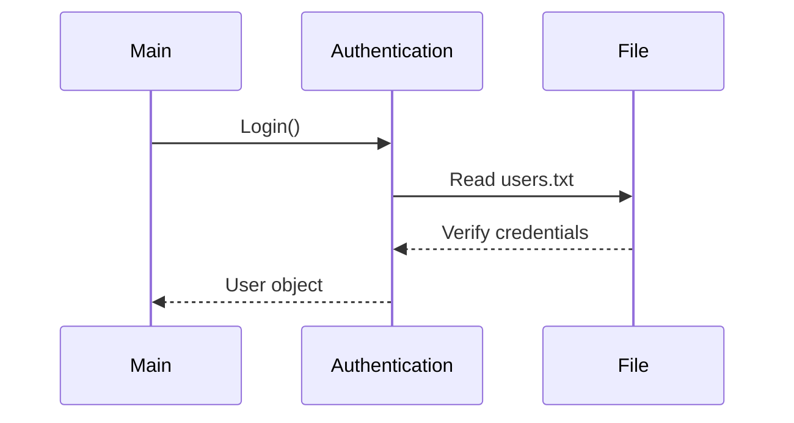

# Documentation
# 🏠 Smart Home Automation System - Complete Documentation

---

## How to Use the System

### 1. Starting the Application
```bash
# Compile all Java files
javac devices/*.java users/*.java utils/*.java Main.java

# Run the system
java Main
```

### 2. Login Credentials
| Role          | Username | Password |
|---------------|----------|----------|
| Admin         | admin    | admin123 |
| Regular User  | user     | user123  |

### 3. Navigation Guide
```
Main Menu → Select Room → Device Control → Enter Command
```

### 4. Key Commands
- **Lights:** `ON/OFF`, `SET BRIGHTNESS 0-100`
- **Fans:** `ON/OFF`, `SET SPEED 0-3`
- **AC:** `SET TEMPERATURE`, `SET MODE [COOL/HEAT/FAN]`
- **Security:** `ARM/DISARM`, `TRIGGER MOTION`

---

## 💡 Device Control System

### Light Device Implementation
```java
public class Light extends Device {
    private int brightness;
    
    // Overloaded methods
    public void setBrightness(int level) {
        this.brightness = Math.max(0, Math.min(100, level));
        System.out.println("Brightness set to " + brightness + "%");
    }
    
    // Varargs implementation
    public void setBrightness(int... levels) {
        if (levels.length > 0) setBrightness(levels[0]);
    }
}
```
**Logic Highlights:**
- Ensures brightness stays within **0-100%** range.
- Provides two ways to set brightness (single value or varargs).

---

## 🔐 Authentication System

### Password Hashing
```java
public String hashPassword(String password) {
    try {
        MessageDigest md = MessageDigest.getInstance("SHA-256");
        byte[] hash = md.digest(password.getBytes());
        StringBuilder sb = new StringBuilder();
        for (byte b : hash) {
            sb.append(String.format("%02x", b));
        }
        return sb.toString();
    } catch (Exception e) {
        return null;
    }
}
```
**Security Features:**
- **SHA-256** password hashing.
- Converts hashed password to a **Hex String**.
- **Error handling** for robustness.

---

## 🤖 Automation Engine

### Motion Detection
```java
public class SecuritySystem extends Device {
    private boolean motionDetected;
    
    public void detectMotion() {
        this.motionDetected = true;
        if (isOn) {
            // Multiple inheritance in action
            new Alarm().triggerAlarm();
            // Automate lights
            HomeAutomation.turnOnAllLights();
        }
    }
    
    // Nested class implementing interface
    public static class Alarm implements SecurityAlert {
        public void triggerAlarm() {
            System.out.println("🚨 ALARM: Motion detected!");
        }
    }
}
```
**Key Components:**
- Event-driven design triggers actions on motion detection.
- Nested `Alarm` class handles **security alerts**.
- Implements `SecurityAlert` interface.

---

## 👥 User Management

### Admin Privileges
```java
public class Admin extends RegularUser {
    // Varargs usage for energy calculation
    public void checkEnergyConsumption(Device... devices) {
        double total = 0;
        for (Device d : devices) {
            total += d.getPowerConsumption();
        }
        System.out.println("Total energy: " + total + "W");
    }
}
```
**Features:**
- Accepts multiple devices using **varargs** for flexible energy calculations.
- Calculates and displays **total energy consumption**.
- Inherits from `RegularUser` while adding **admin-only features**.

---
## 🚀 How It All Works Together
Startup Sequence:


### Device Control Flow:

```java
// Sample command execution
user.controlDevice(light, "SET BRIGHTNESS 75");
light.setBrightness(75);  // Calls overloaded method
```
### Automation Trigger:
```bash
1. Motion detected → SecuritySystem.detectMotion()
2. Alarm.triggerAlarm() executes
3. The lights automatically turn on
```
