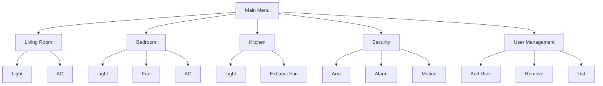
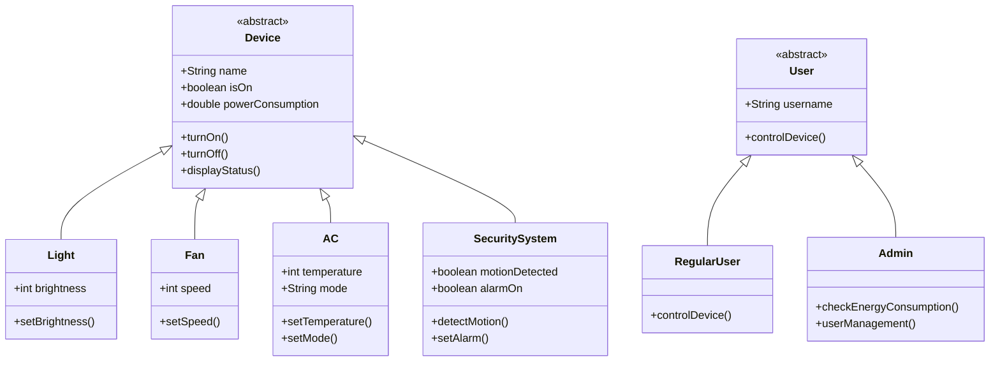

# Smart Home Automation System - Features

## 🏠 Room-Based Device Control
- A Java-based Smart Home Automation System that allows users to control IoT devices (lights, fans, ACs, security systems) via a **`console-based interface`**.
### Living Room
- 💡 Smart Light (On/Off + Brightness 0-100%)
- ❄️ Air Conditioner (Temp Control + Cool/Heat/Fan modes)

### Bedroom
- 💡 Smart Light (On/Off + Brightness 0-100%)
- 🌀 Ceiling Fan (On/Off + 3 Speed Levels)
- ❄️ Air Conditioner (Temp Control + Cool/Heat/Fan modes)

### Kitchen
- 💡 Smart Light (On/Off + Brightness 0-100%)
- 🍳 Exhaust Fan (On/Off + 3 Speed Levels)

### Whole Home Security
- 🚨 Alarm System (Arm/Disarm)
- 👀 Motion Detection
- 🤖 Automated Lighting Responses

## 👥 User Management

### Authentication
- 🔒 SHA-256 Password Hashing
- 📁 Secure Credential Storage
- Default Accounts:
  - Admin: `admin/admin123`
  - User: `user/user123`

### User Types
| Role | Capabilities | Special Access |
|------|-------------|----------------|
| Admin | All device controls | 👥 User Management ⚡ Energy Monitoring |
| Regular User | All device controls | You Ain't him Brdr |

### User Operations
- ➕ Add new users
- ➖ Remove users
- 📜 List all users
- 🔄 Change passwords
- ⚡ Toggle admin privileges

## 🤖 Automation Features

### Motion Detection
- Automatically triggers:
  - Living room lights 💡 (100% brightness)
  - Kitchen lights 💡 (100% brightness)
  - Alarm activation 🚨 (if armed)

### Energy Monitoring (Admin Only)
- 🔌 Real-time power tracking
- 📊 Per-device consumption
- ∑ Total home usage

## 🖥️ System Interface

### Menu Navigation

## Technical Architecture

## Execution Flow
- Application starts (Main.java)

- Authentication screen appears

- User logs in with credentials

- Appropriate menu shown based on role

- User interacts with devices

- System persists changes where needed

- User logs out or exits

## Technical Highlights
### OOP Principles:

- Inheritance (Device → Light/Fan/AC)

- Polymorphism (User → Admin/RegularUser)

- Encapsulation (private fields with public methods)

- Abstraction (abstract classes)

### Security Features:

- Password hashing

- Role-based access control

- Secure credential storage

### Automation:

- Event-driven responses

- Configurable triggers

- Multi-device coordination
### Code snippets
- Authentication & Security
- Password Hashing (SHA-256)
``` java
// Hashing logic in Authentication.java
MessageDigest md = MessageDigest.getInstance("SHA-256");
byte[] hashedBytes = md.digest(password.getBytes());
```
- Secure Password Input
```java
// Masks input with '*' in IDEs, hides completely in terminals
if (System.console() != null) {
    return new String(System.console().readPassword());
}
```
- Device Control Logic
- Light Class Example
```java
public class Light extends Device {
    private int brightness; // 0-100%

    public void setBrightness(int level) {
        if (level >= 0 && level <= 100) {
            this.brightness = level;
            System.out.println(name + " brightness set to " + level + "%");
        }
    }
}
```
- Automation & Event Handling

- Motion Detection Workflow
```java
// In SecuritySystem.java
public void detectMotion() {
    if (isOn) {
        livingRoomLight.turnOn();
        livingRoomLight.setBrightness(100);
    }
}
```
