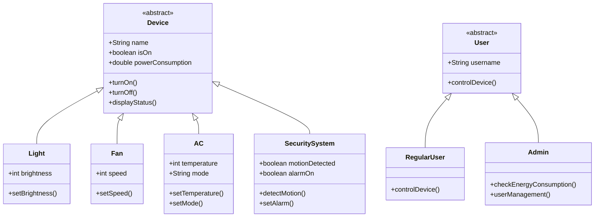
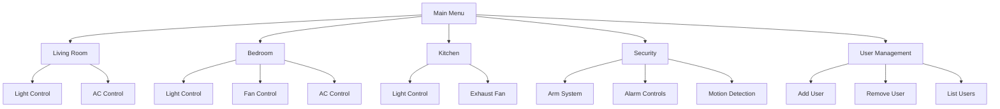

```mermaid
classDiagram
    class Device{
        <<abstract>>
        +String name
        +boolean isOn
        +double powerConsumption
        +turnOn()
        +turnOff()
        +displayStatus()
    }
    
    class Light{
        +int brightness
        +setBrightness()
    }
    
    class Fan{
        +int speed
        +setSpeed()
    }
    
    class AC{
        +int temperature
        +String mode
        +setTemperature()
        +setMode()
    }
    
    class SecuritySystem{
        +boolean motionDetected
        +boolean alarmOn
        +detectMotion()
        +setAlarm()
    }
    
    class User{
        <<abstract>>
        +String username
        +controlDevice()
    }
    
    class RegularUser{
        +controlDevice()
    }
    
    class Admin{
        +checkEnergyConsumption()
        +userManagement()
    }
    
    Device <|-- Light
    Device <|-- Fan
    Device <|-- AC
    Device <|-- SecuritySystem
    User <|-- RegularUser
    User <|-- Admin
```

```mermaid
flowchart TD
    A[Main Menu] --> B[Living Room]
    A --> C[Bedroom]
    A --> D[Kitchen]
    A --> E[Security]
    A --> F[User Management]
    
    B --> B1[Light Control]
    B --> B2[AC Control]
    
    C --> C1[Light Control]
    C --> C2[Fan Control]
    C --> C3[AC Control]
    
    D --> D1[Light Control]
    D --> D2[Exhaust Fan]
    
    E --> E1[Arm System]
    E --> E2[Alarm Controls]
    E --> E3[Motion Detection]
    
    F --> F1[Add User]
    F --> F2[Remove User]
    F --> F3[List Users]
```
