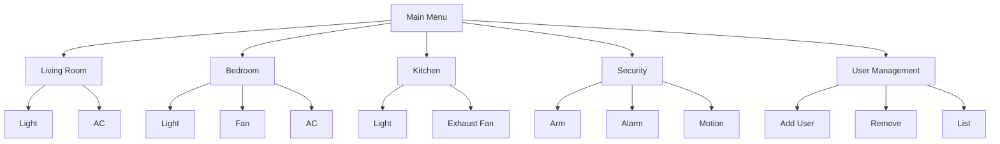
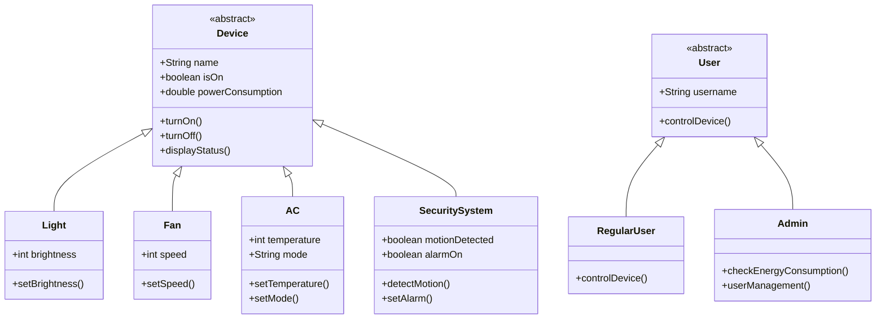

# Smart Home Automation System - Features

## 🏠 Room-Based Device Control

### Living Room
- 💡 Smart Light (On/Off + Brightness 0-100%)
- ❄️ Air Conditioner (Temp Control + Cool/Heat/Fan modes)

### Bedroom
- 💡 Smart Light (On/Off + Brightness 0-100%)
- 🌀 Ceiling Fan (On/Off + 3 Speed Levels)
- ❄️ Air Conditioner (Temp Control + Cool/Heat/Fan modes)

### Kitchen
- 💡 Smart Light (On/Off + Brightness 0-100%)
- 🍳 Exhaust Fan (On/Off + 3 Speed Levels)

### Whole Home Security
- 🚨 Alarm System (Arm/Disarm)
- 👀 Motion Detection
- 🤖 Automated Lighting Responses

## 👥 User Management

### Authentication
- 🔒 SHA-256 Password Hashing
- 📁 Secure Credential Storage
- Default Accounts:
  - Admin: `admin/admin123`
  - User: `user/user123`

### User Types
| Role | Capabilities | Special Access |
|------|-------------|----------------|
| Admin | All device controls | 👥 User Management ⚡ Energy Monitoring |
| Regular User | All device controls | You Ain't him Brdr |

### User Operations
- ➕ Add new users
- ➖ Remove users
- 📜 List all users
- 🔄 Change passwords
- ⚡ Toggle admin privileges

## 🤖 Automation Features

### Motion Detection
- Automatically triggers:
  - Living room lights 💡 (100% brightness)
  - Kitchen lights 💡 (100% brightness)
  - Alarm activation 🚨 (if armed)

### Energy Monitoring (Admin Only)
- 🔌 Real-time power tracking
- 📊 Per-device consumption
- ∑ Total home usage

## 🖥️ System Interface

### Menu Navigation

## Technical Architecture

