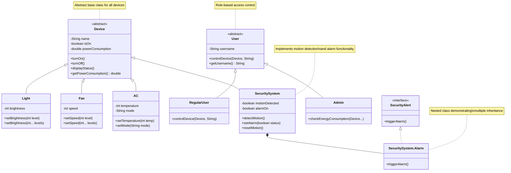

```mermaid
classDiagram
    %% Device Hierarchy
    class Device{
        <<abstract>>
        -String name
        -boolean isOn
        -double powerConsumption
        +turnOn()
        +turnOff()
        +displayStatus()
        +getPowerConsumption() double
    }

    class Light{
        -int brightness
        +setBrightness(int level)
        +setBrightness(int... levels)
    }

    class Fan{
        -int speed
        +setSpeed(int level)
        +setSpeed(int... levels)
    }

    class AC{
        -int temperature
        -String mode
        +setTemperature(int temp)
        +setMode(String mode)
    }

    class SecuritySystem{
        -boolean motionDetected
        -boolean alarmOn
        +detectMotion()
        +setAlarm(boolean status)
        +resetMotion()
    }

    %% User Hierarchy
    class User{
        <<abstract>>
        -String username
        +controlDevice(Device, String)
        +getUsername() String
    }

    class RegularUser{
        +controlDevice(Device, String)
    }

    class Admin{
        +checkEnergyConsumption(Device...)
    }

    %% Interfaces
    class SecurityAlert{
        <<interface>>
        +triggerAlarm()
    }

    %% Nested Class
    class SecuritySystem.Alarm{
        +triggerAlarm()
    }

    %% Relationships
    Device <|-- Light
    Device <|-- Fan
    Device <|-- AC
    Device <|-- SecuritySystem

    User <|-- RegularUser
    User <|-- Admin

    SecuritySystem *-- SecuritySystem.Alarm
    SecurityAlert <|.. SecuritySystem.Alarm

    %% Notes
    note for Device "Abstract base class for all devices"
    note for SecuritySystem "Implements motion detection\nand alarm functionality"
    note for User "Role-based access control"
    note for SecuritySystem.Alarm "Nested class demonstrating\nmultiple inheritance"
```
